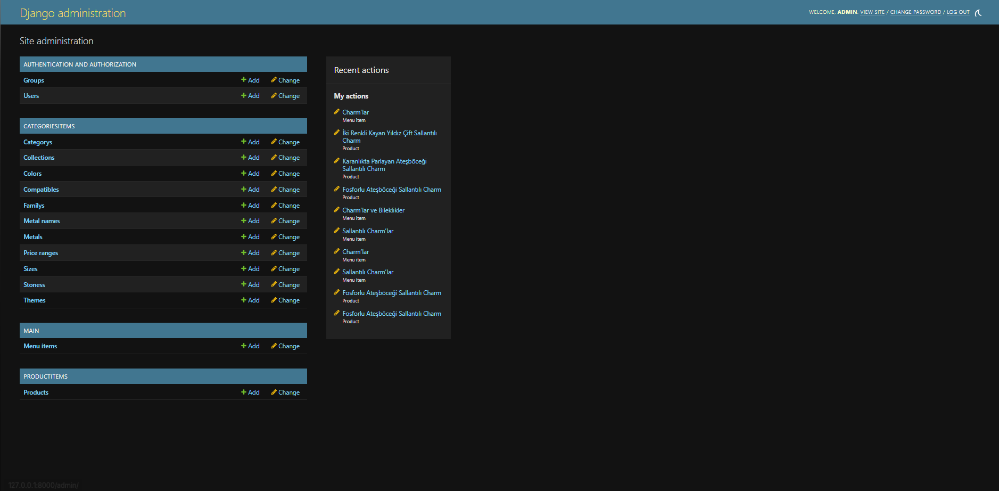

# 💍 Pandora Tarzı E-Ticaret Sitesi Klonu | Gerçek Zamanlı Filtreleme & Mobil Uyum

Bu proje, dünyaca ünlü Pandora'nın alışveriş deneyimini birebir taklit ederek sıfırdan geliştirildi.  
Gerçek zamanlı filtreleme, ürün varyasyonları ve mobil uyumlu tasarımıyla, modern bir e-ticaret sitesinin tüm parçalarını içinde barındırır.

---

## 🌟 Öne Çıkan Özellikler

### ⚡️ Gerçek Zamanlı Filtreleme (AJAX)
- Filtreleme seçenekleri: **Metal**, **Renk**, **Fiyat Aralığı**, **Koleksiyon** vb.
- Sayfa yenilemeden anında ürünleri filtrele
- URL parametrelerine filtre bilgileri otomatik eklenir → paylaşılabilir link yapısı

### 💎 Ürün Ailesi & Varyasyon Geçişi
- Ürün detay sayfasında aynı modelin farklı renk varyasyonlarını gör
- Hover’da önizleme + tıklamada ilgili sayfaya yönlendirme
- Otomatik görsel güncelleme

### 📱 Mobil Uyumlu Tasarım
- Filtreler mobil için özel menüde gösterilir
- Ürün listesi mobilde 2 sütunlu, masaüstünde 4 sütunlu yapı
- Performans için lazy-loading kullanıldı

### ❤️ Favori Sistemi
- Favorilere ürün ekle (localStorage ile tutulur)
- “Tamamlayıcı Ürünler” öneri sistemi

---

## 🔧 Kullanılan Teknolojiler

| Katman       | Teknoloji         | Açıklama                                 |
|--------------|-------------------|------------------------------------------|
| **Backend**  | Django             | Ürün yönetimi, filtreleme endpoint'leri |
| **Frontend** | Vanilla JavaScript | AJAX işlemleri, filtreleme, etkileşim   |
|              | Bootstrap 5        | Responsive tasarım                      |
| **Tasarım**  | CSS3 + Flexbox     | Mobil uyumlu özel stiller               |
| **API**      | Axios              | AJAX istekleri                          |

---
## 🖥️ Masaüstü Görünümler

|🏠 Ana Sayfa |
|-------------|
[](https://youtu.be/4rmXltN4lzM)

---

|🛍️ Ürün Listesi |
|-------------|
[](https://youtu.be/CaPrFtV_Wsk)

---

|📄 Ürün Detay |
|-------------|
[](https://youtu.be/DF_GKciMD50)

---

## 📱 Mobil Görünümler

### 🏠 Ana Sayfa  
[](https://youtu.be/67BQphoCt7k)

---

### 🛍️ Ürün Listesi  
[](https://youtu.be/jwreRi7uapE)

---

### 📄 Ürün Detay  
[](https://youtu.be/5GOwtd5PvBY)

---

## 🖥️ Admin Panel Preview



Bu admin paneli, e-ticaret operasyonlarının hızlı ve verimli bir şekilde yönetilmesini sağlar. Panel üzerinden aşağıdaki işlemler gerçekleştirilebilir:

🛒 Yeni ürünlerin eklenmesi ve mevcut ürün bilgilerinin güncellenmesi

📁 Ürün kategorilerinin oluşturulması ve düzenlenmesi

👤 Kullanıcı verilerinin görüntülenmesi ve yönetilmesi

📦 Siparişlerin takibi ve sipariş durumlarının güncellenmesi

🗂️ Stok kontrolü ve ürün envanter yönetimi

💬 Kullanıcı yorumlarının görüntülenmesi ve yönetimi

Bu panel, e-ticaret süreçlerini merkezileştirerek kullanıcı dostu bir yönetim deneyimi sunar.


## ⚙️ Kurulum

```bash
# 1. Repoyu klonla 
git clone https://github.com/GoktugGok/jewelry-e-commerce.git
cd .\jewelryECommerce\

# 2. Sanal Ortam 
python -m venv venv
source venv/bin/activate  # Mac/Linux
venv\Scripts\activate     # Windows

# 3. Gereken Paketlerin Kurulumu
pip install -r requirements.txt

# 4. Veritabanı Migrasyonları
python manage.py migrate

# 5. Yönetici (Admin) Kullanıcısı Oluşturma
python manage.py createsuperuser

# 6. Projeyi Başlatma
python manage.py runserver

